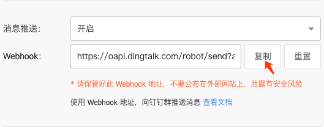
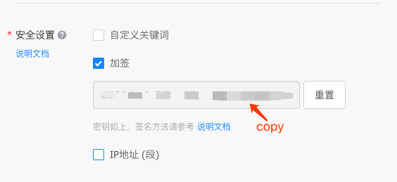

# dingtalk
[](https://goreportcard.com/report/github.com/sunny0826/dingtalk)


A Send DingTalk Message Golang SDK

## Installing

### go get
```bash
go get -u github.com/sunny0826/dingtalk
```

### get token & sign

1. get token

    
    
    Copy webhook and get `https://oapi.dingtalk.com/robot/send?access_token={YOUR_TOKEN}`,`{TOUR_TOKEN}` is your token.

2. get sign
    
    
    
    Copy the sign.

3. Use custom keywords or IP addresses(Optional)

    
    
    If you don't want to use the sign, please set `YOUR_DINGTALK_SIGN=''`. Then you can use the custom keywords or IP addresses.
    
### example
```go
import (
    "github.com/sunny0826/dingtalk"
)

func main() {
	webHook := dingtalk.NewWebHook("YOUR_DINGTALK_TOKEN", "YOUR_DINGTALK_SIGN")

	// test send text message
	err := webHook.SendTextMsg("Test text message", false, "")
	if nil != err {
		t.Error("token missing error should be catch!")
	}
}
```